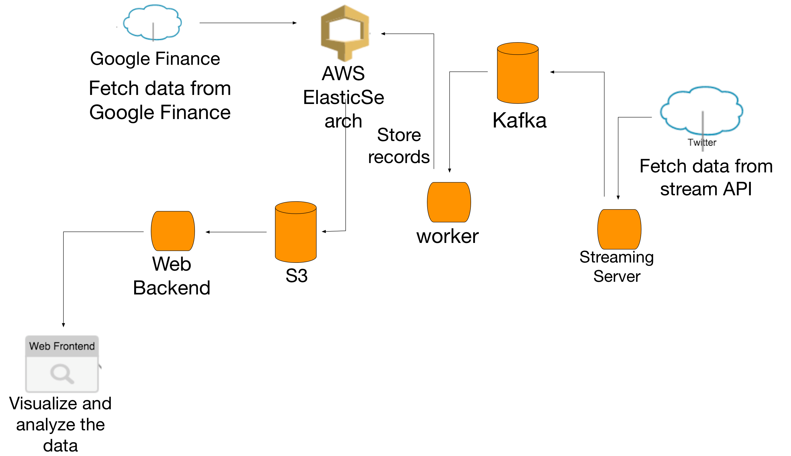

# stock_tweets_analysis
Stock market is changing all the time and investors may be looking for relevant information to help them make investment decisions. Public mood can be an important factor of stock trends. The public mood can be estimated by performing sentiment analysis from tweets. Thus, sentiments in tweets may be an indicator for the trend of stock market and may help making decisions on investments for investors.
## Tech Stack
* Google Finance API: Fetch real-time prices of certain stocks per minute.
* Twitter Streaming API: Stream real-time tweets.
* Elasticsearch: Save and search stocks data and tweets with sentiment. 
* Kafka: Asynchronous processing of tweets for sentiment analysis.
* TextBlob: Analyze sentiment in text.
* Django: Python web framework.
* D3.js: Visualize stock trends and related tweet contents as well as their proportions.
#### AWS
* AWS Elastic Beanstalk: web backend/frontend.
* AWS Elasticsearch: 
      * `stocks 
      * `tweets
* AWS EC2: 
      * `tweets streaming server
      * `sentiment analysis worker
      * `Kafka (and zookeeper)
* AWS S3: Store historical stocks and tweets data.

## Architecture Diagram

